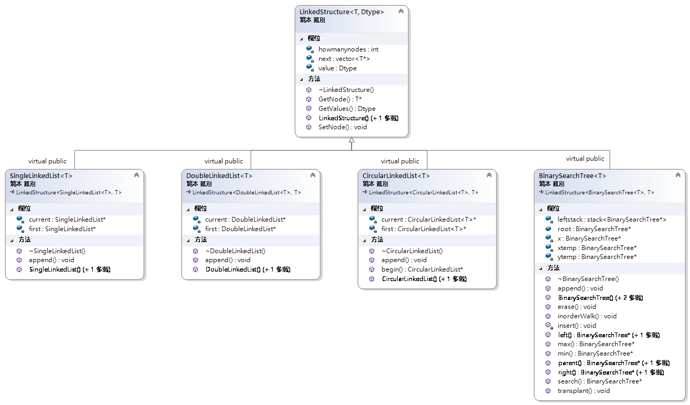
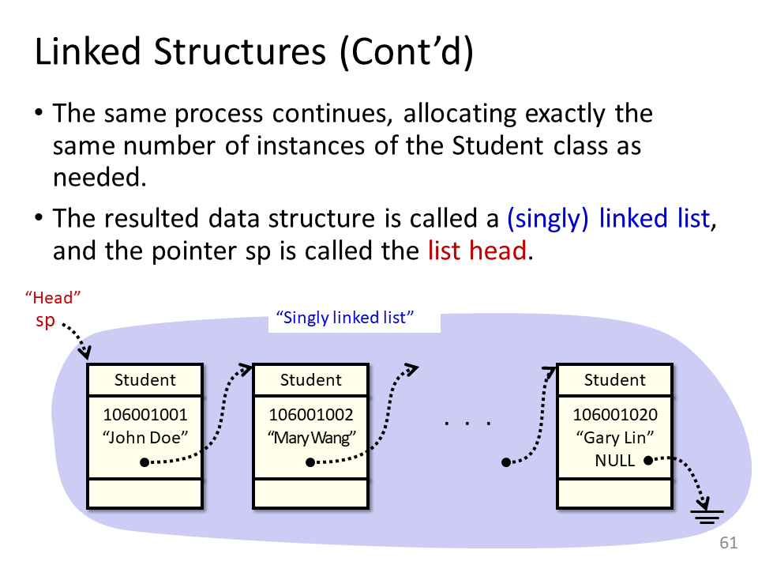
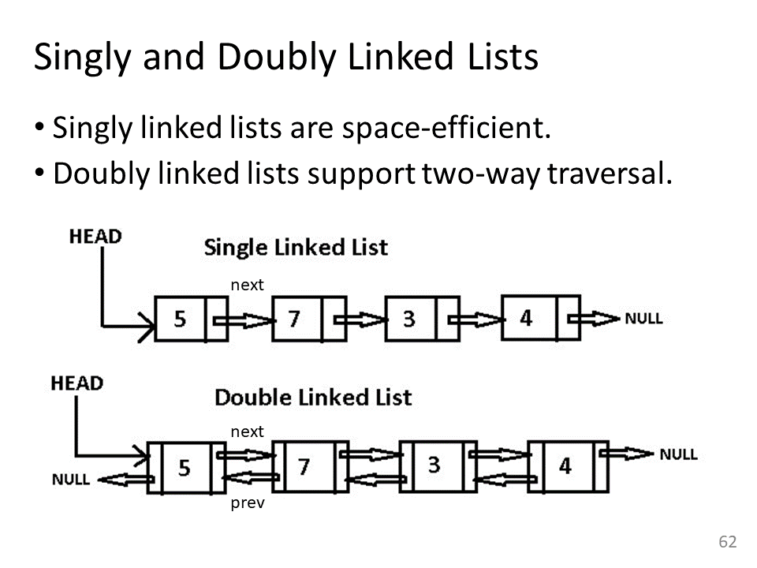
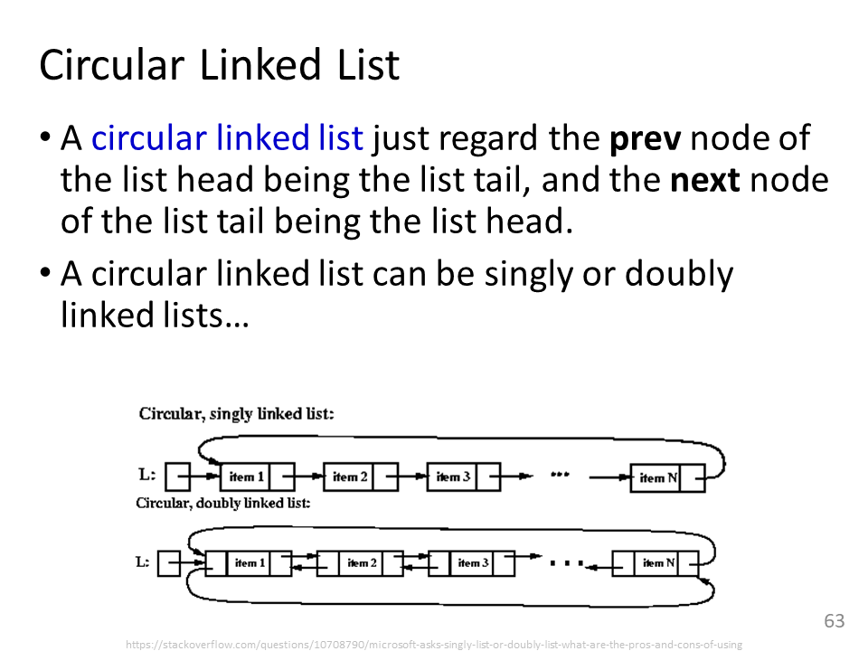

# List
----
This is a C++ based listing structure using OOP (Object-Oriented Program). The following is implementation of list structure, including [single linked list](#single-linked-list), [double linked list](#double-linked-list), and [circlar linked list](#Circular-Linked-List) 

----


## Single linked list

The single linked list, delineated at fig1, is an one directional chain node by node. It is defined by two classes, [LinkedStructure](#LinkedStructure) and [SingleLinkedList](#SingleLinkedList). 
The first is a definition of a node, which contains a value with certain type and pointers to the relative nodes.
The last is a definition of a list. It defines an addition method, called append.
>
>fig1. Po-Chun Huang(2018), Data Structure, NTUT EE

* #### LinkedStructure<br>
```LinkeStructure.h``` defines the characteristics of a node. The two major parts are ```vector<T *>next``` and ```Dtype value```. They store the adress of node and value respectively.
Specifically, ```next``` is a ```vector``` with a template ```T``` in order to establish the multiple connection.
The template ```T``` implements a polymorphistic data type. ```Dtype``` is the same idea. 
However, ```T``` represents which type of a node and ```Dtype``` represents the type of value in a node.

Constructor, ```LinkedStructure(int how_many_nodes)```, will assign the numbers of linkage for a node with ```nullptr```. 
Also, you can pass a value through ```LinkedStructure(Dtype input_values, int how_many_nodes)```.

Here are three methods to retrive and reconfigue the nodular address and value: 

```C++ numbers-line
template<typename T>
void SetNode(T* nextnode, int nodenum)
```
It allows user to reassign the nodular address, ```T* nextnode```, at location ```nodenum``` of a ```vector<T *>next```.
```C++ numbers-line
T* GetNode(int nodenum)
```
It responses a nodular address at location ```nodenum``` of a ```vector<T *>next```.
```C++ numbers-line
Dtype GetValues()
```
It responses the value in a node.<br><br>


* #### SingleLinkedList
```SingleLinkedList.h``` virtually inherits from ```LinkeStructure.h``` and defines one linkage list.
The constructor, ```SingleLinkedList(T inputvalue)```, will assign the value and one linkage to ```LinkeStructure.h```.
Here are one method to add a value into the list.
```C++ numbers-line
virtual void append(T input_value);
```
It will create a new node for ```input_value``` and aneal the node to the end of list through ```SetNode()``` and ```It will create a new node for ```input_value``` and aneal the node to the end of list through ```SetNode()``` and ```)```It will create a new node for ```input_value``` and aneal the node to the end of list through ```SetNode()``` and ```It will create a new node for ```input_value``` and aneal the node to the end of list through ```SetNode()``` and ```GetNode()```.
>````C++ numbers-line
>while (current->GetNode(0) != nullptr)
>{
>	current = current->GetNode(0);
>}
>````
Find the last node in a list by ```GetNode()```

>```C++ numbers-line
>current->SetNode(newnode, 0);
>```
Aneal the new node into the end by ```SetNode()```

----
## Double-Linked List

The double-linked list, delineated at fig2 , is a two directional chain. The double-linked list is defined by two classes, [LinkedStructure](#LinkedStructure) and DoubleLinkedList. 
The first is introduced in the above paragraph.
The last is the same as [```SingleLinkedList.h```](#SingleLinkedList) besides that every nodes store the address of a parent and a child.
>
>fig2. Po-Chun Huang(2018), Data Structure, NTUT EE

* #### DoubleLinkedList
The algorithm is follow the [SingleLinkedList](#SingleLinkedList) except for the two nodular address and anealing process.

1. ###### Two nodular address

    The constructor, ```DoubleLinkedList(T inputevalue)```, will assign two value and one linkage to ```LinkeStructure.h```.

2. ###### Anealing process
    ```C++ numbers-line
    newnode->SetNode(current, 1);
    ```
   It configues the parental address by ```SetNode()```. 1 represnts the second address in ```vector<T *>next```.

---
## Circular Linked List

The circular linked list, delineated at fig3 , is bidirectional loop. The circular linked list is defined by two classes, [LinkedStructure](#LinkedStructure) and CircularLinkedList. 
The first is introduced in the above paragraph.
The last is the same as [```DoubleLinkedList.h```](#DoubleLinkedList) besides that the last one will point to the first.
```newnode->SetNode(first, 0)``` links the end to the first at the anealing process. 

Every node contains the ```CircularLinkedList<T>* first;```
, which refer to the address of the first node in the list.
```C++ numbers-line
template<typename T>
CircularLinkedList(T inputvalue, CircularLinkedList<T>* node);
```
The private contructor is limited for append method. It will assign the address of the first node in every child node
>
>fig3. Po-Chun Huang(2018), Data Structure, NTUT EE


