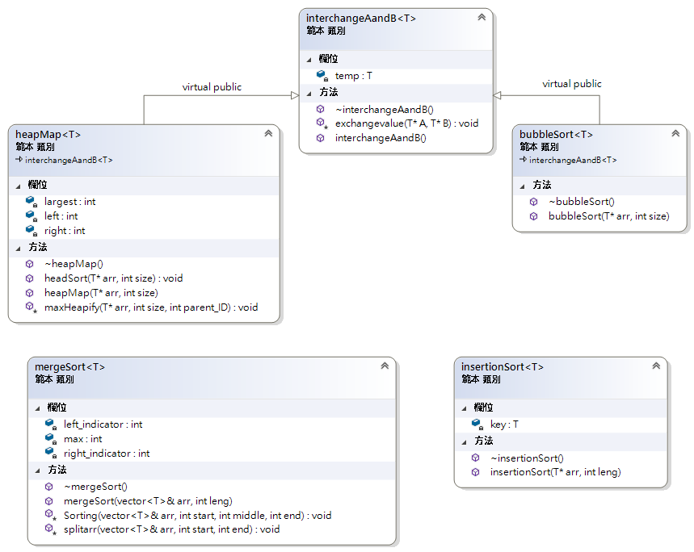
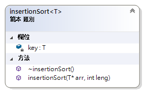
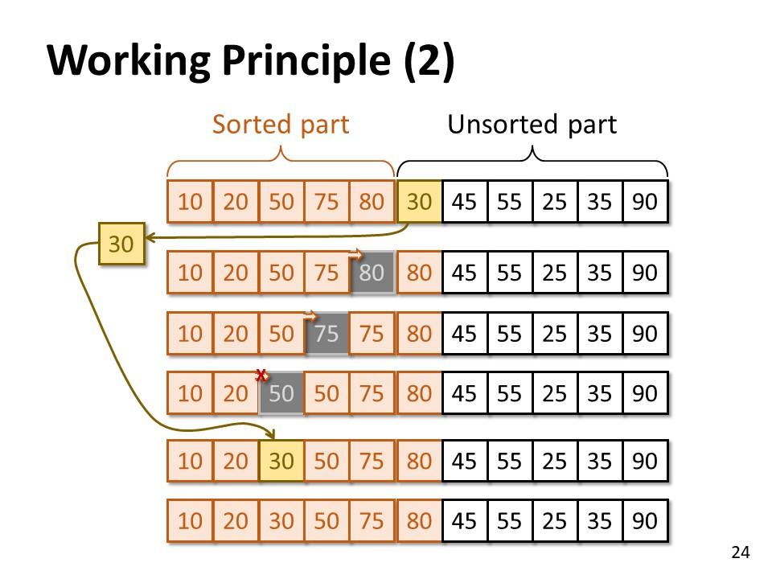
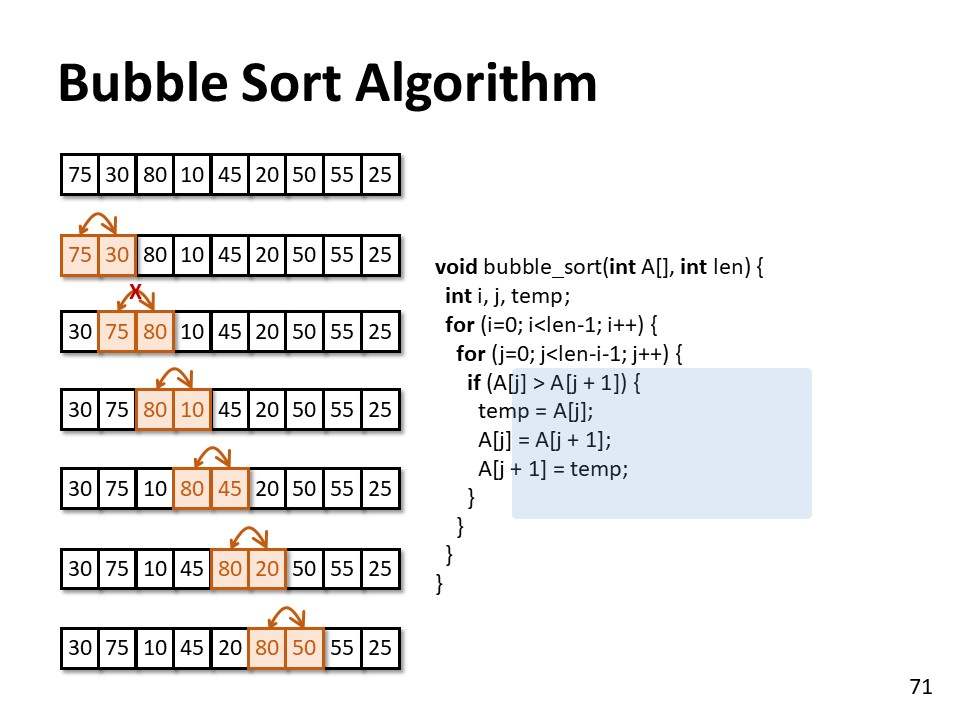
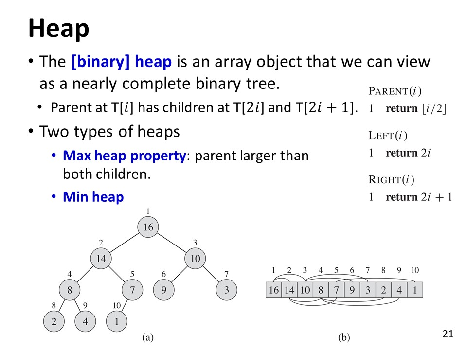
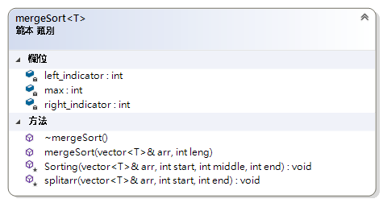
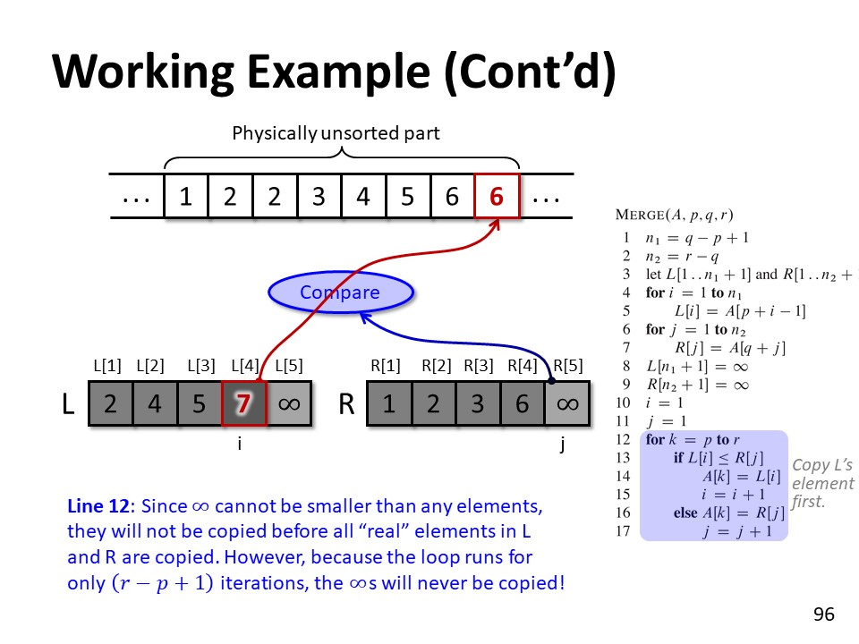

# Sorting
----
This is the C++ based sorting program using OOP(Object-Oriented Program). The following is four algorithms of sorting, including [insertion](#1-insertion-sorting), [bubble](#2-bubble-sorting), [heap](#3-heap-sorting) and [merge](#4-merge-sorting).<br><br>
There is a parental class, called interchangeAandB. It implements an exchange A and B. The heap sorting and bubble sorting use the parental class by virtual inheritance. It will avoid the conflict of the calling function while the main program starting.

----



#### 1. Insertion Sorting


You successively chose a value and insert it into a forwarding position, which is smaller than the next one and larger than the previous. For instance, the fig1 demonstrates that 30 is extracted and insert into the position between 20 and 50. The position is three steps forward compared to its original state.
* Time Complexity =  *O(n<sup>2</sup>)*
* Space Complexity = *O(1)*
>
>fig1. Po-Chun Huang(2018), Data Structure, NTUT EE
##### algorithm of insertion
```C++ line-numbers
insertionSort(T* arr, int leng);
```
You just put any types of an array, T* arr, by reference. Also, the length of an array is required.
<br><br>


#### 2. Bubble Sorting

You successively swap a value with its next one until it is smaller than the next one. For instance, the fig2 demonstrates that 75 swaps with 30 and stop in front of 80.
* Time Complexity =  *O(n<sup>2</sup>)*
* Space Complexity = *O(1)*
>
>fig2. Po-Chun Huang(2018), Data Structure, NTUT EE
##### algorithm of bubble
```C++ line-numbers
bubbleSort(T* arr, int size);
```
You just put any types of an array, T* arr, by reference. Also, the length of an array is required.
<br><br>


#### 3. Heap Sorting

You can transform an array into a heapMap, which is every node is larger than its two children. For instance, fig3 demonstrates that the first element of an array is 16. 16 is larger than its two children, 14 and 10. The relation between parent and children is T[i] and T[2i]/T[2i + 1].
* Time Complexity =  *O(lg n)*
* Space Complexity = *O(1)*
>
>fig3. Po-Chun Huang(2018), Data Structure, NTUT EE
##### algorithm of heap
it contains two parts, heap transformation, and heap sorting. The description is the following:
1. Heap Transformation
    ```C++ line-numbers
    heapMap(T* arr, int size);
    ```
    You just put any types of an array, T* arr, by reference. Also, the length of an array is required. It will transform it into a heap-formed array by calling maxHeapify.
    ```C++ line-numbers
    void maxHeapify(T* arr, int size, int parent_ID);
    ```
    maxHeapify is a protected function. It will check the rank for the parent-child node, and rearrange the largest number as a parent.

2. Heap Sorting
    ```C++ line-numbers
    void headSort(T* arr, int size);
    ```
    It share same insturction of use;however, it requries an <b>HEAP</b>-form array. It's really important. A <b>HEAP</b> array is necessary and essential.
<br><br>


#### 4. Merge Sorting 


An array will successively split into two sub-arrays. Then, every unit of these sub-arrays will extract and restore into a new one by comparison two sub-arrays.
* Time Complexity =  *O(n)*
* Space Complexity = *O(n)*
>
>fig4. Po-Chun Huang(2018), Data Structure, NTUT EE
##### algorithm of merge
```C++ line-numbers
mergeSort(std::vector<T>& arr, int leng);
```
First, at all, it requires a [vector](https://en.wikipedia.org/wiki/Sequence_container_(C%2B%2B)) other than an array. A vector is necessary and essential. Also, the length of a vector is required. While sorting, it will call two protected function, splitarr and sorting.

1. splitarr
    ```C++ line-numbers
    void splitarr(std::vector<T>& arr, int start, int end);
    ```
    The main purpose of the function is to recursively split the vector into two parts until only two elements exist. Then, it will call the sorting function to anneal the two parts from bottom to top.

2. Sorting
    ```C++ line-numbers
    template<typename T>
    inline void mergeSort<T>::Sorting(std::vector<T>& arr, 
                                        int start, int middle, int end)
    {
        std::vector<T>leftarr(arr.begin()+start, arr.begin()+middle+1);
        std::vector<T>rightarr(arr.begin()+middle+1, arr.begin()+end+1);
    ```
    It will copy a vector, from start to middle, into a left vector. Also, a arr from middle to end will be copied into a right vector.
    ```C++ line-numbers
    leftarr.insert(leftarr.end(), max);
    rightarr.insert(rightarr.end(), max);
    ```
    Then, it will append a maximum value into the last of a left and right vector.
    ```C++ line-numbers
    max = std::numeric_limits<T>::max();
    ```
    The maximum value will be configured at constructor. It will auto configured based on the data type.
    ```C++ line-numbers
    if (leftarr[left_indicator] <= rightarr[right_indicator])
    {
        arr[i] = leftarr[left_indicator];
        left_indicator++;
    }
    else
    {
        arr[i] = rightarr[right_indicator];
        right_indicator++;
    }
    ```
    The core of the merge sorting is the comparison and deposition. It compares the left vector to the right vector. Every element will be checked with another vector one by one. It will deposit into the sorting vector if it is smaller than other.
<br><br>
