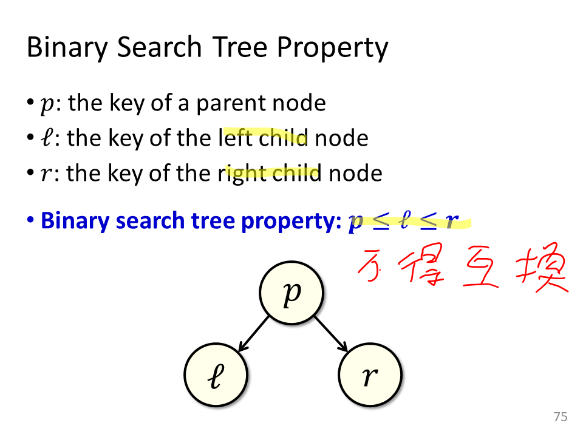

# Tree
----
This is a C++ based listing structure using OOP (Object-Oriented Program). The following is implementation of tree structure based on List 

----


## Binary Search Trees(BST)
The BST inherits the property of ```LinkedListStructure.h``` and defines two child node for every node. 
The left child is smaller than the right, as describe on fig1. Its interchangeble property makes the algorithm a convenient search engine.

>
>fig1. Po-Chun Huang(2018), Data Structure, NTUT EE

While node is established through ```BinarySearchTree(T value)```, it contains four pointers which link to its relatives.

1. ```BinarySearchTree* root``` : point to the base node 
2. ```BinarySearchTree* parent()``` : point to the previous node 
3. ```BinarySearchTree* left()``` : point to the following node, which is smaller
4. ```BinarySearchTree* right()``` : point to the following node, which is larger

Each of them provide the configuration the nodular address based on the ```void SetNode(T* nextnode, int nodenum)``` and ```T* GetNode(int nodenum)```.  
Once the node is created, user can add the new value by ```void append(T input_value)``` or delete the existing one by ```void erase(BinarySearchTree* deletednode)```

* #### Append
    The append function creates a new node and call the ```void insert(BinarySearchTree* insertValue)```.
The insert function will insert the new one into the tree by ascending order. We describe the detail as following:
   1. find the nearest value
        ```c++ number-lines
        while (xtemp != nullptr){
		    ytemp = xtemp;

		    if ((insertValue->GetValues()) < (xtemp->GetValues())){
			    xtemp = xtemp->left();
		    }else{
			    xtemp = xtemp->right();
		    }
	    }
        ```
        It will iterate on the left side of the root if the input value is samller than the root, vice reversa.

  2. configure the nearest value as new one's parent
        ```c++ numbers-line
       insertValue->parent(ytemp);
        ```

  3. link the nearest value to the new one
        ```c++ numbers-line
        if (ytemp == nullptr){
	        this->root = insertValue;
   	        insertValue->root = insertValue;
        }
        ``` 
        New one will be the root if the nearest value doesn't exist.
        ```c++ numbers-line
        else if ((insertValue->GetValues()) < (ytemp->GetValues())){
		    ytemp->left(insertValue);
		    insertValue->root = this->root;
	    }else{
		    ytemp->right(insertValue);
		    insertValue->root = this->root;
	    }    
        ```
        
        Conversely, the new one will be the left child if its value is lower than parent, vice reversa.
<br><br>
* #### Erase
    The erase function is to delete a node which is specified by the selected value. The algorithm combines with ```void transplant(BinarySearchTree* deletednode, BinarySearchTree* nextOfdeletednode)``` and ```BinarySearchTree* min()```.
    1. ```void transplant(BinarySearchTree* deletednode, BinarySearchTree* nextOfdeletednode)```
        
        Transplant function is to replace an existing node with a selected node. THe algorithm will anneal the parent node of an existing node to the selected node, detail as fig2.
        >
        >fig2. Po-Chun Huang(2018), Data Structure, NTUT EE

    2. ```BinarySearchTree* min()```
        
        min function is to search the last left child from the root.
        ```c++ numbers-line
        x = root;

	    while (x->left() != nullptr){
		    x = x->left();
	    }
        ```
    
    The erase function will delete an existing node by two steps, illustrated at fig2.
1. Aneal the opposite child to the parent node of a deleted node if one of the child is null.
    ```c++ numbers-line
    if (deletednode->left() == nullptr){
		transplant(deletednode, deletednode->right());
	}
	else if (deletednode->right() == nullptr){
		transplant(deletednode, deletednode->left());
	}
    ```
2. If both of child is existed, find the smallest node on the right child, then 
    ```c++ numbers-line
    x = deletednode->right()->min();
    ```
   1. Transplant the smallest with its child node
        ```c++ numbers-line
        if (x->parent() != deletednode){
		    transplant(x,x->right());
		    x->right(deletednode->right());
		    x->right()->parent(x);
	    }
        ```
   2. Replace the deleted node with the smallest
        ```c++ numbers-line
        transplant(deletednode,x);
	    x->left(deletednode->left());
	    x->left()->parent(x);
        ```
